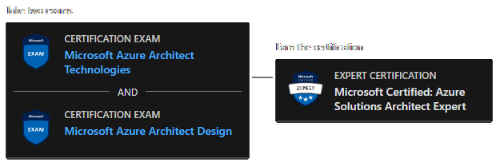
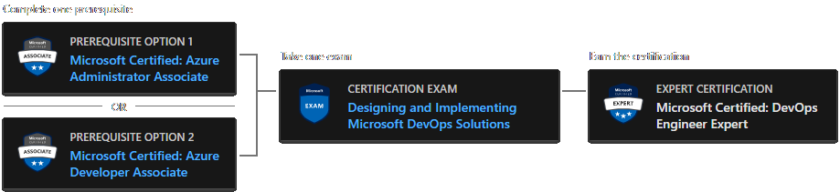
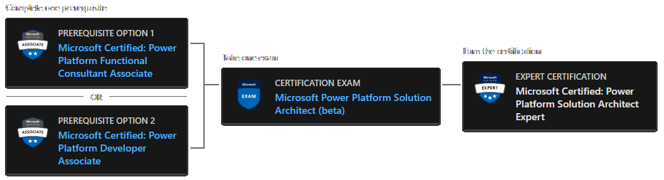

## Microsoft Certified: Expert ★★★

### [AZ-303, AZ-304](https://docs.microsoft.com/en-gb/learn/certifications/azure-solutions-architect/) Azure Solutions Architect Expert

Candidates for the Azure Solutions Architect Expert certification should have subject matter expertise in designing and implementing solutions that run on Microsoft Azure, including aspects like compute, network, storage, and security. Candidates should have intermediate-level skills for administering Azure. Candidates should understand Azure development and DevOps processes.

Responsibilities for this role include advising stakeholders and translating business requirements into secure, scalable, and reliable cloud solutions.

An Azure Solution Architect partners with cloud administrators, cloud DBAs, and clients to implement solutions.

A candidate for this certification should have advanced experience and knowledge of IT operations, including networking, virtualization, identity, security, business continuity, disaster recovery, data platform, budgeting, and governance–this role should manage how decisions in each area affect an overall solution. In addition, this role should have expert-level skills in Azure administration and have experience with Azure development and DevOps processes.

#### **Prerequisites**

* [Exam AZ-303: Microsoft Azure Architect Technologies](https://docs.microsoft.com/en-gb/learn/certifications/exams/az-303) (See: [Instructor-led Training](https://docs.microsoft.com/en-gb/learn/certifications/courses/az-303t00))
* [Exam AZ-304: Microsoft Azure Architect Design](https://docs.microsoft.com/en-gb/learn/certifications/exams/az-304) (See: [Instructor-le Training](https://docs.microsoft.com/en-gb/learn/certifications/courses/az-304t00))

### [AZ-400](https://docs.microsoft.com/en-gb/learn/certifications/devops-engineer/) DevOps Engineer Expert

Candidates for the DevOps Engineer Expert certification should have subject matter expertise working with people, processes, and technologies to continuously deliver business value.

Responsibilities for this role include designing and implementing strategies for collaboration, code, infrastructure, source control, security, compliance, continuous integration, testing, delivery, monitoring, and feedback.

A candidate for this certification must be familiar with both Azure administration and development and must be expert in at least one of these areas.

#### **Prerequisites**

One of:

 * [Certification: Azure Administrator Associate](https://docs.microsoft.com/en-gb/learn/certifications/azure-administrator/) (See: [Exam: AZ-104](https://docs.microsoft.com/en-gb/learn/certifications/exams/az-104), [Instructor-led Training](https://docs.microsoft.com/en-gb/learn/certifications/courses/az-104t00))
 * [Certification: Azure Developer Associate](https://docs.microsoft.com/en-gb/learn/certifications/exams/az-304) (See: [Exam: AZ-204](https://docs.microsoft.com/en-gb/learn/certifications/exams/az-204), [Instructor-led Training](https://docs.microsoft.com/en-gb/learn/certifications/courses/az-204t00))

Then:

 * [Exam AZ-400: Designing and Implementing Microsoft DevOps Solutions](https://docs.microsoft.com/en-gb/learn/certifications/exams/az-400) (See: [Instructor-led Training](https://docs.microsoft.com/en-gb/learn/certifications/courses/az-400t00))

### [PL-600](https://docs.microsoft.com/en-gb/learn/certifications/power-platform-solution-architect-expert/): Power Platform Solution Architect Expert 

If you’re looking to prove your expertise as a Microsoft Power Platform or Microsoft Dynamics 365 solution architect, or if you’re a developer or a senior consultant ready to take the next step to become a solution architect, this expert certification can help you move forward in your career.

As a candidate for the Power Platform Solution Architect Expert certification, you work with stakeholders and focus on solutions that affect your organization’s broad business and technical needs. You have functional and technical knowledge of Power Platform, Dynamics 365 customer engagement apps, related Microsoft cloud solutions, and third-party technologies. For this certification, you need a minimum of 1 to 3 years as a Power Platform solution architect or 7 to 10 years as a senior consultant or developer, along with deep knowledge of Power Platform architecture.

#### **Prerequisites**

One of:

 * [Certification: Power Platform Functional Consultant Associate](https://docs.microsoft.com/en-gb/learn/certifications/power-platform-functional-consultant-associate/) (See: [Exam: PL-200](https://docs.microsoft.com/en-gb/learn/certifications/exams/pl-200), [Instructor-led Training](https://docs.microsoft.com/en-gb/learn/certifications/courses/pl-200t00))
 * [Certification: Power Platform Developer Associate](https://docs.microsoft.com/en-gb/learn/certifications/power-platform-developer-associate/) (See: [Exam: PL-400](https://docs.microsoft.com/en-gb/learn/certifications/exams/pl-4000), [Instructor-led Training](https://docs.microsoft.com/en-gb/learn/certifications/courses/pl-400t00))

Then:

 * [Exam PL-600: Microsoft Power Platform Solution Architect (beta)](https://docs.microsoft.com/en-gb/learn/certifications/exams/pl-600) (Currently no instructor-led training)

